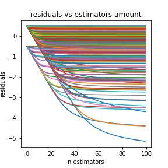
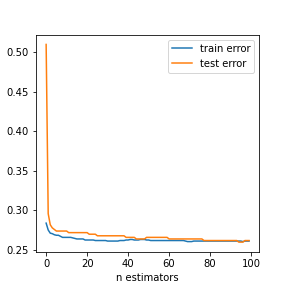
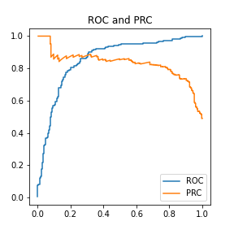
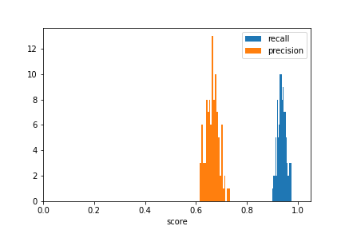

## Gradient Boosting Machine

Enssemble algorithm, written on Python from scratch for binary classification problem.
As a base algorithm Logistic Regression is being used.
At the end I use bootstraping for predictions many times (Poisson) and evaluate distrubution of model metricts.

This machine evaluates residuals per estimators.

Provide error estimation.

Also evaluate ROC and PRC curves.

Cherry on a cake - predictions sampled with a Poisson bootstrap. It allowed to evaluate variance of a model metrics.

